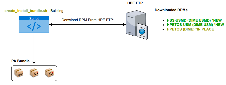
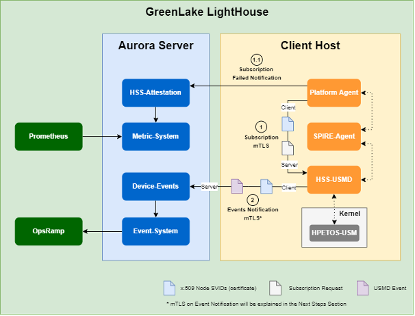
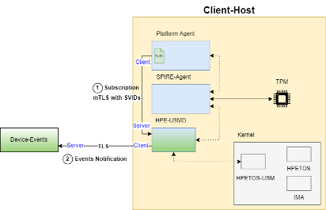
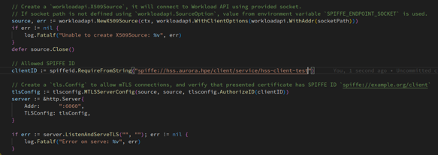
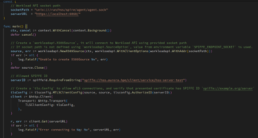
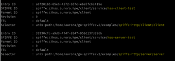
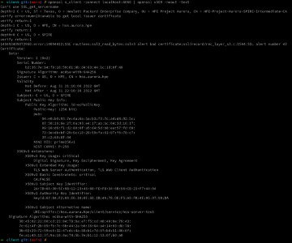
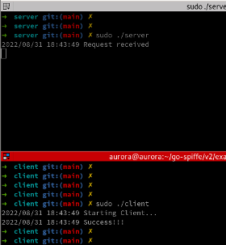

# USM Integration with AIE

| Author:| Status: (WIP \| In Review \| Approved \| Obsolete) |
| :--- | :--- |
| Engineering Manager: Rodolfo Pirotti | Created: |
| DRC Sponsor: | Milestone/Initiative: |

## Introduction

Describe changes made to add support for USMD integration with Aurora.

## Risks and Assumptions

* DIME-USM Team will deliver an RPM file that will install USMD daemon during hss-deploy process. This RPM needs to be downloaded and installed from an FTP repository (similar to other DIME RPMs aurora uses)

* HPETOS-USM and USMD runs for both Physical and VM machines.

* DIME-USMD provides endpoints for Subscriptions management. Once subscription is created USMD will start sending events.

* HSS-Device events will initially receive USMD events using the same endpoint as iLO. Need to differentiate them somehow.

## Approach

Note the design approach

## Scope

### Feature Scope (IS)

This feature consists of the integration of USM with AIE, so that events and metrics monitored in the user space are received by Aurora. To ensure that this integration is working as expected, it is necessary to validate different aspects of the feature, as shown below:

* **Deploy**
  * The create_install_bundle.sh script should be able to download the RPM files and install correctly the USMD (daemon), and HPETOS-USM (kernel module);
  * Both components should be up and running;
  * USMD should be able to work with SPIRE certificate.

* **Subscription**
  * The hss-platform-agent should be able to communicate and create the subscription on USMD. This communication will be mTLS using SPIRE-Based certificates;
  * The information passed when creating the subscription must be stored in the database.  

* **Events**
  * The hss-device-events must receive the alerts sent by the USMD according to the type of attack made. This must be true for all existing events;
  * Received events must be parsed and saved correctly in the database.

* **Metrics**
  * The hss-metric-system must receive metrics correctly according to the reproduced failures;
  * If the subscription process fails, the PAPA should send a metric to server and the hss-metric-system should receive and parse it correctly;
  * Depending on the design on VF-5642, if it is decided to turn Metric System into an AP, it is necessary to validate if the operations (GET and POST, as example), of the endpoint are working as expected;
  * Depending on the design on VF-5642, the hss-metric-system should receive correctly the HPETOS-USM metrics dmesg, parse and store in the database.

> Note: Feature Testing Scope planning depends on some designs yet to be done, for this reason some points can be added or removed.  

### Feature Scope (IS-NOT)

As previously discussed, the scope of this feature is the integration of USM with AIE. For this reason, what is included in coverage will be the tests related to installing USMD and its dependencies toghether Aurora components and validating its correct functioning with Aurora components like PAPA, Device-Events, Event-System, Metric-System components. Tests to validate USM itself, which are not related to USM and AIE integration, will NOT be covered under the scope of this test plan.

Regarding (1), if a test case has limitations for which it cannot be run on a virtual machine, this will be documented.

## Designs Considered/Considerations

### RPM Download (create_install_bundle.sh)

RPM will be downloaded from HSE FTP, similar what is currently being done for Non-USM HPETOS RPM on create_install_bundle.sh script (function download_dime_packages). This function will have to be modified and/or extended to cover new USM packages listed below.



* [HSS-USMD](http://vfrepo.br.rdlabs.hpecorp.net/Dime/hss-usmd/stable-dev/SLES-15.3/hss-usmd-1.0.0-1.sles15sp3.x86_64.rpm)

* [HPETOS-USM](http://vfrepo.br.rdlabs.hpecorp.net/Dime/hpetos-usm/stable-dev/SLES-15.3/hpetos-usm-kmp-default-1.0.0-343.27.sles15sp3.x86_64.rpm)

#### RPM Install (hss-deploy.sh)

**Configuration can be done at image build time with Yogi`s scripts
**Configuration pre-configured in rpm (Talk with Knuppe Team)

* RPM installation will copy config files (/etc/hss/config):
  * hss-usm.json: USMD configuration file. This file specifies USMD configurations such as Listen Port (5024) and SPIRE settings (SPIRE Agent socket and HSS-TrustBundle paths).
  
  Default values should work, it does not requires changes.
  * hpetos-usm-register.conf: HPETOS USM Register configuration file. This file specifies the list of files to be monitored by USM.
    * hss-deploy.sh will need to configure it, pointing the PAPA binary to be monitored.
    * hss-deploy.sh also will need to load/reload the Kernel Module HPETOS after configuring list of binaries to be monitored on the configuration file.

#### Useful commands

```bash
        sudo rmmod hpetos-usm
        sudo modprobe hpetos-usm
        sudo dmesg
        sudo dmesg –w   (to follow)
        sudo insmod ./hpetos-usm.ko
```

### USM Communication Overview



## Design

### Create subscription from PAPA

Unlike other strategies, which made the creation of the subscription in USMD a Device Events responsibility, here the idea is to perform this process through PAPA. Leaving the subscription process to PAPA, will avoid that the server perform a request to the agent to create it, making the whole process internal. PAPA also can easily get a valid SVID to communicate with USMD, which will avoid great modifications in another components.

The image below, presents a high-level architecture of communication with the USMD, where the subscription process is performed by the Platform Agent:



In general, after starting, the Platform Agent obtains the SVIDs of the services and performs the setup of these services. After that, if the PAPA still does not have the trust-bundle, it is downloaded and before starting the device verification, the RIM file is sent to the server. After this process, the Continuous Device Verification is started, where it is verified if the device has already been provisioned (if not, the provisioning is performed), and then the device verification process is carried out. These steps can be seen in the image below in the components illustrated in green.

To create the subscription, it was considered that the device would have to be provisioned so that all the necessary information is available. Therefore, for this design proposal, it was decided that the component responsible for the subscription process would be called after checking the device provisioning (and consequent provisioning, if it has not yet occurred).  The integration of the subscription process in PAPA consists of checking if the subscription already exists. If so, the PAPA will proceed with the device verification, and if not, the SVID will be obtained for the USMD subscription client, and then the subscription will be created for the USMD. The subscription process integrated with PAPA is shown in the image below with the components illustrated in purple.

• USMD subscription to happen after hss-provisioning is completed, because at this time system UUID is known.

### PAPA to create subscription

PAPA to create subscription and then SVID to communicate with USMD (aligned with create subscription strategy)

#### Server App using go-spiffe to obtain SVID (simulating USMD)



#### Client App using go-spiffe to obtain SVID (simulating PA)

• Client app using localhost to call server app



#### SPIRE Entries



#### Server App SVID



#### Test Connection Result



## Secutity

The current security scans must run successfully with out regressions.

## Failure Modes

## References

* [Aurora SPIRE Entries Registries](https://github.hpe.com/pivs/wiki/blob/master/howto/SPIRE-Support.md#spire-server)
* [HSS-USMD](http://vfrepo.br.rdlabs.hpecorp.net/Dime/hss-usmd/stable-dev/SLES-15.3/hss-usmd-1.0.0-1.sles15sp3.x86_64.rpm)

## Glossary

## Checklist

* [ ] Security Validation
* [x] QA Sync
